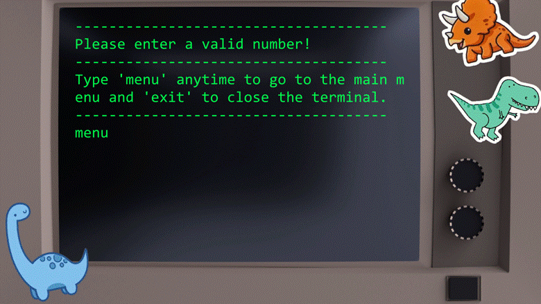
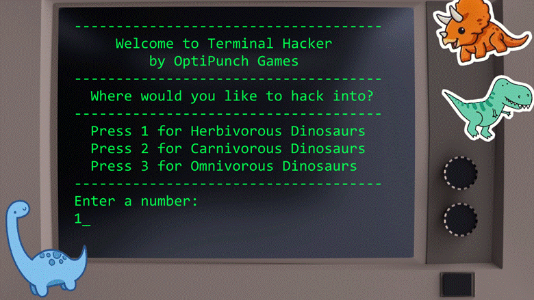
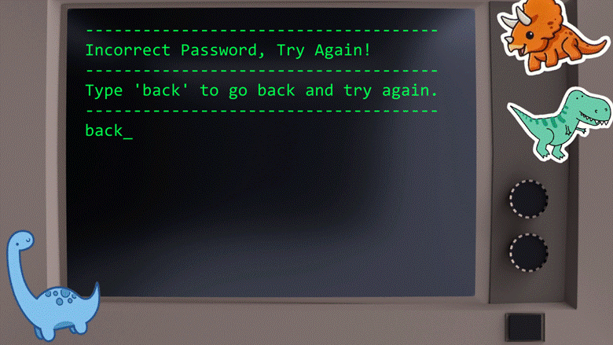
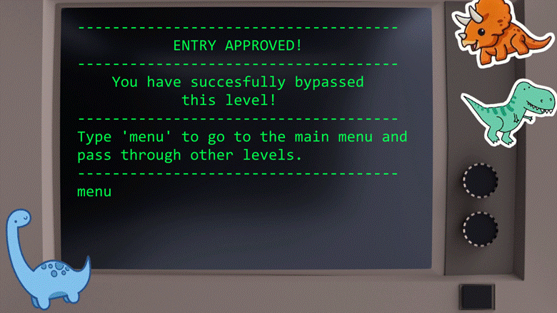
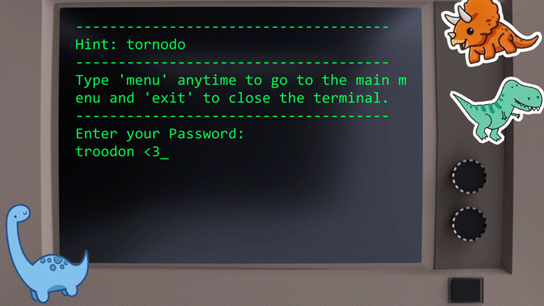
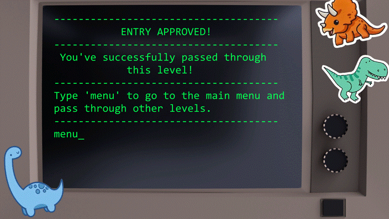
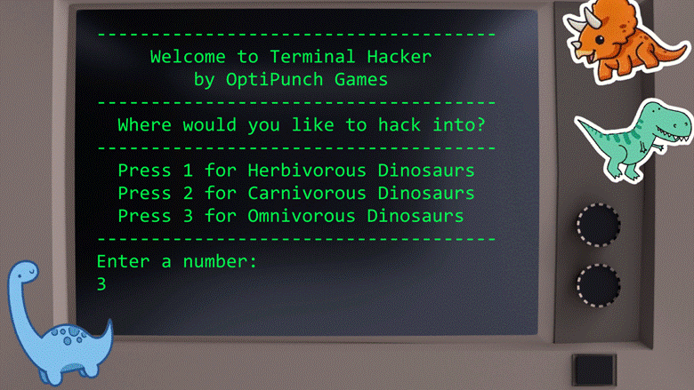
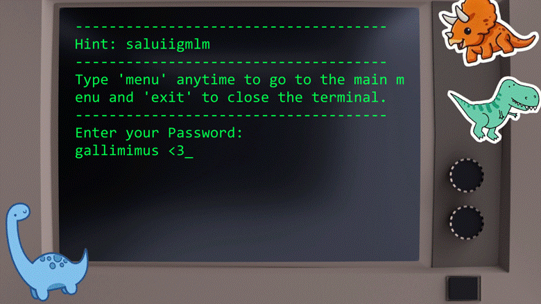
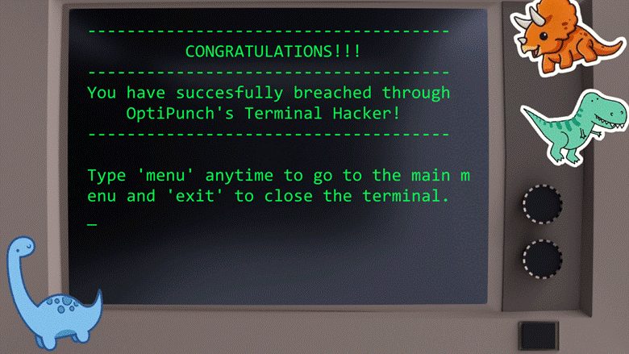

# game-dev-terminal-hacker
CET3 Game Dev Class Activity [Terminal Hacker]
<html xmlns:v="urn:schemas-microsoft-com:vml"
xmlns:o="urn:schemas-microsoft-com:office:office"
xmlns:w="urn:schemas-microsoft-com:office:word"
xmlns:m="http://schemas.microsoft.com/office/2004/12/omml"
xmlns="http://www.w3.org/TR/REC-html40">

<body lang=EN-US style='tab-interval:.5in;word-wrap:break-word'>

<b style='mso-bidi-font-weight:normal'><o:p>&nbsp;</o:p></b>

<h2>Main Menu</h2>

<b style='mso-bidi-font-weight:normal'><o:p>&nbsp;</o:p></b>

<b style='mso-bidi-font-weight:normal'><!--[if gte vml 1]><v:shapetype id="_x0000_t75"
 coordsize="21600,21600" o:spt="75" o:preferrelative="t" path="m@4@5l@4@11@9@11@9@5xe"
 filled="f" stroked="f">
 <v:stroke joinstyle="miter"/>
 <v:formulas>
  <v:f eqn="if lineDrawn pixelLineWidth 0"/>
  <v:f eqn="sum @0 1 0"/>
  <v:f eqn="sum 0 0 @1"/>
  <v:f eqn="prod @2 1 2"/>
  <v:f eqn="prod @3 21600 pixelWidth"/>
  <v:f eqn="prod @3 21600 pixelHeight"/>
  <v:f eqn="sum @0 0 1"/>
  <v:f eqn="prod @6 1 2"/>
  <v:f eqn="prod @7 21600 pixelWidth"/>
  <v:f eqn="sum @8 21600 0"/>
  <v:f eqn="prod @7 21600 pixelHeight"/>
  <v:f eqn="sum @10 21600 0"/>
 </v:formulas>
 <v:path o:extrusionok="f" gradientshapeok="t" o:connecttype="rect"/>
 <o:lock v:ext="edit" aspectratio="t"/>
</v:shapetype><v:shape id="image1.png" o:spid="_x0000_i1041" type="#_x0000_t75"
 style='width:468pt;height:263.4pt;visibility:visible;mso-wrap-style:square'>
 <v:imagedata src="TerminalHacker_readme_files/image001.png" o:title=""/>
</v:shape><![endif]--><![if !vml]><![endif]><o:p></o:p></b>

<b style='mso-bidi-font-weight:normal'> 
</b>

<b style='mso-bidi-font-weight:normal'><o:p>&nbsp;</o:p></b>

<h2>Invalid Number Input Screen</h2>

<b style='mso-bidi-font-weight:normal'><o:p>&nbsp;</o:p></b>

<b style='mso-bidi-font-weight:normal'><!--[if gte vml 1]><v:shape id="image16.png" o:spid="_x0000_i1040"
 type="#_x0000_t75" style='width:468pt;height:263.4pt;visibility:visible;
 mso-wrap-style:square'>
 <v:imagedata src="TerminalHacker_readme_files/image003.png" o:title=""/>
</v:shape><![endif]--><![if !vml]><![endif]><o:p></o:p></b>

<b style='mso-bidi-font-weight:normal'><o:p>&nbsp;</o:p></b>

<h2>Level 1 (Herbivore Dinosaurs Category [4-5 Letters])</h2>

<b style='mso-bidi-font-weight:normal'><o:p>&nbsp;</o:p></b>

<b style='mso-bidi-font-weight:normal'><!--[if gte vml 1]><v:shape id="image8.png" o:spid="_x0000_i1039"
 type="#_x0000_t75" style='width:468pt;height:263.4pt;visibility:visible;
 mso-wrap-style:square'>
 <v:imagedata src="TerminalHacker_readme_files/image005.png" o:title=""/>
</v:shape><![endif]--><![if !vml]><![endif]><o:p></o:p></b>

<b style='mso-bidi-font-weight:normal'><o:p>&nbsp;</o:p></b>

<b style='mso-bidi-font-weight:normal'><!--[if gte vml 1]><v:shape id="image9.png" o:spid="_x0000_i1038"
 type="#_x0000_t75" style='width:468pt;height:263.4pt;visibility:visible;
 mso-wrap-style:square'>
 <v:imagedata src="TerminalHacker_readme_files/image007.png" o:title=""/>
</v:shape><![endif]--><![if !vml]><![endif]><o:p></o:p></b>

<b style='mso-bidi-font-weight:normal'><o:p>&nbsp;</o:p></b>

<h3>Incorrect Password Screen</h3>

<b style='mso-bidi-font-weight:normal'><o:p>&nbsp;</o:p></b>

<b style='mso-bidi-font-weight:normal'><!--[if gte vml 1]><v:shape id="image11.png" o:spid="_x0000_i1037"
 type="#_x0000_t75" style='width:468pt;height:263.4pt;visibility:visible;
 mso-wrap-style:square'>
 <v:imagedata src="TerminalHacker_readme_files/image009.png" o:title=""/>
</v:shape><![endif]--><![if !vml]><![endif]><o:p></o:p></b>

<b style='mso-bidi-font-weight:normal'><o:p>&nbsp;</o:p></b>

 

<b style='mso-bidi-font-weight:normal'><o:p>&nbsp;</o:p></b>

<h3>Level 1 Win Screen</h3>

<b style='mso-bidi-font-weight:normal'><o:p>&nbsp;</o:p></b>

<b style='mso-bidi-font-weight:normal'><!--[if gte vml 1]><v:shape id="image15.png" o:spid="_x0000_i1036"
 type="#_x0000_t75" style='width:468pt;height:263.4pt;visibility:visible;
 mso-wrap-style:square'>
 <v:imagedata src="TerminalHacker_readme_files/image011.png" o:title=""/>
</v:shape><![endif]--><![if !vml]><![endif]><o:p></o:p></b>

<b style='mso-bidi-font-weight:normal'><o:p>&nbsp;</o:p></b>

<b style='mso-bidi-font-weight:normal'><!--[if gte vml 1]><v:shape id="image12.png" o:spid="_x0000_i1035"
 type="#_x0000_t75" style='width:468pt;height:263.4pt;visibility:visible;
 mso-wrap-style:square'>
 <v:imagedata src="TerminalHacker_readme_files/image013.png" o:title=""/>
</v:shape><![endif]--><![if !vml]><![endif]><o:p></o:p></b>

<b style='mso-bidi-font-weight:normal'><o:p>&nbsp;</o:p></b>

 

<b style='mso-bidi-font-weight:normal'><o:p>&nbsp;</o:p></b>

<h2>Level 2 (Carnivore Dinosaurs Category [6-7 Letters])</h2>

<b style='mso-bidi-font-weight:normal'><o:p>&nbsp;</o:p></b>

<b style='mso-bidi-font-weight:normal'><!--[if gte vml 1]><v:shape id="image10.png" o:spid="_x0000_i1034"
 type="#_x0000_t75" style='width:468pt;height:263.4pt;visibility:visible;
 mso-wrap-style:square'>
 <v:imagedata src="TerminalHacker_readme_files/image015.png" o:title=""/>
</v:shape><![endif]--><![if !vml]><![endif]><o:p></o:p></b>

<b style='mso-bidi-font-weight:normal'><o:p>&nbsp;</o:p></b>

<b style='mso-bidi-font-weight:normal'><!--[if gte vml 1]><v:shape id="image3.png" o:spid="_x0000_i1033"
 type="#_x0000_t75" style='width:468pt;height:263.4pt;visibility:visible;
 mso-wrap-style:square'>
 <v:imagedata src="TerminalHacker_readme_files/image017.png" o:title=""/>
</v:shape><![endif]--><![if !vml]><![endif]><o:p></o:p></b>

<b style='mso-bidi-font-weight:normal'><o:p>&nbsp;</o:p></b>

 

<b style='mso-bidi-font-weight:normal'><o:p>&nbsp;</o:p></b>

<h3>Incorrect Password Screen</h3>

<b style='mso-bidi-font-weight:normal'><o:p>&nbsp;</o:p></b>

<b style='mso-bidi-font-weight:normal'><!--[if gte vml 1]><v:shape id="_x0000_i1032" type="#_x0000_t75"
 style='width:468pt;height:263.4pt;visibility:visible;mso-wrap-style:square'>
 <v:imagedata src="TerminalHacker_readme_files/image019.png" o:title=""/>
</v:shape><![endif]--><![if !vml]><![endif]><o:p></o:p></b>

<b style='mso-bidi-font-weight:normal'><o:p>&nbsp;</o:p></b>

<h3>Level 2 Win Screen</h3>

<b style='mso-bidi-font-weight:normal'><o:p>&nbsp;</o:p></b>

<b style='mso-bidi-font-weight:normal'><!--[if gte vml 1]><v:shape id="image13.png" o:spid="_x0000_i1031"
 type="#_x0000_t75" style='width:468pt;height:263.4pt;visibility:visible;
 mso-wrap-style:square'>
 <v:imagedata src="TerminalHacker_readme_files/image021.png" o:title=""/>
</v:shape><![endif]--><![if !vml]><![endif]><o:p></o:p></b>

<b style='mso-bidi-font-weight:normal'><o:p>&nbsp;</o:p></b>

<b style='mso-bidi-font-weight:normal'><!--[if gte vml 1]><v:shape id="image5.png" o:spid="_x0000_i1030"
 type="#_x0000_t75" style='width:468pt;height:263.4pt;visibility:visible;
 mso-wrap-style:square'>
 <v:imagedata src="TerminalHacker_readme_files/image023.png" o:title=""/>
</v:shape><![endif]--><![if !vml]><![endif]><o:p></o:p></b>

<b style='mso-bidi-font-weight:normal'><o:p>&nbsp;</o:p></b>

<h2>Level 3 (Omnivore Dinosaurs Category [8+ Letters])</h2>

<b style='mso-bidi-font-weight:normal'><o:p>&nbsp;</o:p></b>

<b style='mso-bidi-font-weight:normal'><!--[if gte vml 1]><v:shape id="image2.png" o:spid="_x0000_i1029"
 type="#_x0000_t75" style='width:468pt;height:263.4pt;visibility:visible;
 mso-wrap-style:square'>
 <v:imagedata src="TerminalHacker_readme_files/image025.png" o:title=""/>
</v:shape><![endif]--><![if !vml]><![endif]><o:p></o:p></b>

<b style='mso-bidi-font-weight:normal'><o:p>&nbsp;</o:p></b>

<b style='mso-bidi-font-weight:normal'><!--[if gte vml 1]><v:shape id="image14.png" o:spid="_x0000_i1028"
 type="#_x0000_t75" style='width:468pt;height:263.4pt;visibility:visible;
 mso-wrap-style:square'>
 <v:imagedata src="TerminalHacker_readme_files/image027.png" o:title=""/>
</v:shape><![endif]--><![if !vml]><![endif]><o:p></o:p></b>

<b style='mso-bidi-font-weight:normal'><o:p>&nbsp;</o:p></b>

<h3>Incorrect Password Screen</h3>

<b style='mso-bidi-font-weight:normal'><o:p>&nbsp;</o:p></b>

<b style='mso-bidi-font-weight:normal'><!--[if gte vml 1]><v:shape id="image4.png" o:spid="_x0000_i1027"
 type="#_x0000_t75" style='width:468pt;height:263.4pt;visibility:visible;
 mso-wrap-style:square'>
 <v:imagedata src="TerminalHacker_readme_files/image019.png" o:title=""/>
</v:shape><![endif]--><![if !vml]><![endif]><o:p></o:p></b>

<b style='mso-bidi-font-weight:normal'><o:p>&nbsp;</o:p></b>

 

<b style='mso-bidi-font-weight:normal'><o:p>&nbsp;</o:p></b>

<h3>Level 3 Win Screen</h3>

<b style='mso-bidi-font-weight:normal'><o:p>&nbsp;</o:p></b>

<b style='mso-bidi-font-weight:normal'><!--[if gte vml 1]><v:shape id="image6.png" o:spid="_x0000_i1026"
 type="#_x0000_t75" style='width:468pt;height:263.4pt;visibility:visible;
 mso-wrap-style:square'>
 <v:imagedata src="TerminalHacker_readme_files/image030.png" o:title=""/>
</v:shape><![endif]--><![if !vml]><![endif]><o:p></o:p></b>

<b style='mso-bidi-font-weight:normal'><o:p>&nbsp;</o:p></b>

<b style='mso-bidi-font-weight:normal'><!--[if gte vml 1]><v:shape id="image7.png" o:spid="_x0000_i1025"
 type="#_x0000_t75" style='width:468pt;height:263.4pt;visibility:visible;
 mso-wrap-style:square'>
 <v:imagedata src="TerminalHacker_readme_files/image032.png" o:title=""/>
</v:shape><![endif]--><![if !vml]><![endif]></b>

</body>

</html>
